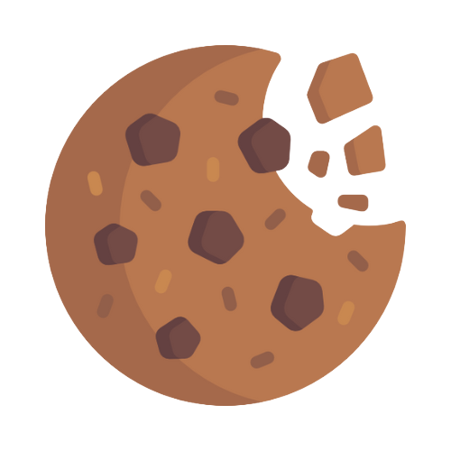

<h1 style="text-align: center;"> 
    Welcome to the <a href="https://github.com/Hugo-LML/tp-git-grp-6">CookieStrap</a> community
</h1>

CookieStrap is a brand new feature-packed frontend toolkit, with a vast variety of themes, icons and more.

[How can you contribute ?](https://github.com/Hugo-LML/tp-git-grp-6/blob/main/CONTRIBUTING.md) | [Code of conduct](https://github.com/Hugo-LML/tp-git-grp-6/blob/main/CODE_OF_CONDUCT.md)

[Bug report ? New features ? Improvements ? Feel free to create a new issue here](https://github.com/Hugo-LML/tp-git-grp-6/issues/new/choose)

## Authors
- [@Hugo LEMERLE](https://github.com/Hugo-LML)
- [@Gauthier SIRCHIA](https://github.com/GootPyke)
- [@Inès MAGANGA](https://github.com/DeevaWitch)